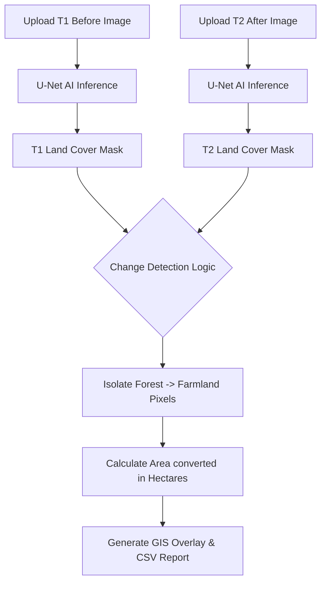

# Final Project Report
**Project Title:** AI-Based Forest-to-Farmland Change Detection Using GIS

---

## 1. Introduction
Rapid conversion of forest land into agricultural fields is one of the leading causes of global deforestation, contributing significantly to biodiversity loss and carbon emissions. Monitoring these changes manually using traditional surveying or basic satellite imagery inspection is labor-intensive, slow, and unscalable. This project introduces a fully automated, Artificial Intelligence (AI) powered Geographic Information System (GIS) platform that leverages Deep Learning to automatically detect, highlight, and quantify regions where forests have been converted to farmland over time.

---

## 2. Problem Definition

### 2.1. Problem Statement
The manual monitoring of deforestation is inefficient and incapable of keeping up with the rapid pace of illegal or undocumented agricultural expansion. Traditional GIS approaches lack automation and struggle with complex spectral overlaps (e.g., distinguishing natural brown forests during dry seasons from newly plowed farmland). The challenge this project addresses is the need for a highly accurate, near real-time, automated system that takes "Before" and "After" satellite images and precisely computes the geographical area converted from forest to farmland.

### 2.2. Background Information (Literature Review)
Historically, GIS change detection relied on thresholding techniques using the Normalized Difference Vegetation Index (NDVI). While useful, NDVI often produces false positives due to seasonal changes. Recent advancements in Computer Vision have introduced Convolutional Neural Networks (CNNs) for image segmentation. Architectures like U-Net have shown state-of-the-art performance in biomedical imaging and are now being adapted for remote sensing. The EuroSAT dataset (Helber et al., 2019), derived from Sentinel-2 satellite imagery, established a benchmark for land-cover classification, paving the way for the deep learning methodology utilized in this project.

---

## 3. Objectives

### 3.1. Primary Objectives
* Develop a Deep Learning segmentation model capable of accurately classifying satellite pixels into "Forest" or "Farmland".
* Automate the comparison between T1 (Before) and T2 (After) satellite imagery to isolate exact regions of conversion.
* Quantitatively calculate the total converted area in hectares to aid environmental monitoring.

### 3.2. Secondary Objectives
* Design and deploy a user-friendly, web-based GIS dashboard that requires no coding experience to operate.
* Ensure the system can process standard image formats as well as complex scientific GeoTIFF files.

---

## 4. Methodology

### 4.1 Approach
The project utilizes a Supervised Deep Learning approach. We implemented a **PyTorch U-Net Architecture**, a type of fully convolutional network designed for semantic segmentation. The model learns spatial contexts and features from the EuroSAT dataset to classify land cover. Post-inference, a matrix comparison algorithm isolates pixels that transitioned from class "Forest" to class "Farmland".

### 4.2 Procedures
1. **Data Preparation:** Download and preprocess the EuroSAT dataset into PyTorch data loaders.
2. **Model Training:** Train the U-Net model on an RTX 3050 GPU using Cross-Entropy Loss to minimize classification errors.
3. **Inference Pipeline:** Pass T1 and T2 images through the model to generate segmentation masks.
4. **Change Detection:** Apply a boolean mask (`T1 == Forest & T2 == Farmland`) to isolate deforestation.
5. **Web Deployment:** Wrap the pipeline in a Streamlit application and deploy to the cloud via GitHub.

### 4.3 Flow Chart

---

## 5. Project Execution

### 5.1 Planning and Design
Initial planning involved researching optimal neural network architectures for remote sensing. U-Net was chosen over Mask R-CNN due to its efficiency on pixel-wise classification tasks. The design drafted for the user interface prioritized simplicity: side-by-side image uploads, a centralized GIS viewer, and a bottom-aligned metrics dashboard.

### 5.2 Implementation
The project was constructed in phases. First, the PyTorch backend was established (`unet.py`, `train.py`). A critical implementation challenge involved handling raw TIF files, which was overcome by integrating the `rasterio` library. Finally, the Streamlit frontend (`app.py`) was linked to the PyTorch inference engine, and the entire platform was containerized and pushed to Streamlit Community Cloud for live deployment.

---

## 6. Tools and Techniques Used

### 6.1 Tools
* **VS Code:** Primary Integrated Development Environment (IDE).
* **Git & GitHub LFS:** Used for version control and hosting large model files (124 MB).
* **Rasterio & GeoPandas:** Used for robust geospatial TIF file handling and matrix manipulation.

### 6.2 Techniques & Core Technologies
* **Deep Learning (Image Segmentation):** Chosen because traditional pixel-color thresholding fails under varying lighting/seasonal conditions. The AI learns complex spatial textures.
* **Boolean Masking:** Used to rapidly compute spatial differences between two integer arrays.

> [!IMPORTANT]
> ### Core Architecture Highlights
> * **Backend:** `Python` and `PyTorch` (Powers the U-Net Neural Network and mathematical matrix operations).
> * **Frontend:** `Streamlit` (A rapid web-app framework that serves the interactive UI and handles file uploads).
> * **Database:** Local File System & Git LFS (Stores the `.pth` model weights and temporary uploaded imagery; a traditional SQL database was bypassed for stateless cloud execution).

### Mathematical Formulas
To calculate the total deforested area, the system counts the changed pixels and multiplies them by the spatial resolution of the satellite. Assuming Sentinel-2 imagery (10 meters per pixel):
`Area in Square Meters = Number of Converted Pixels × (10m × 10m)`
`Area in Hectares (ha) = Area in Square Meters / 10,000`

---

## 7. Partial Results

### 7.1 Initial Findings
During early execution, training the U-Net on a CPU was highly inefficient, taking ~46 minutes per epoch. Initial tests with standard `PIL` image loaders failed when evaluating multi-band satellite `.tif` files.

### 7.2 Iterative Improvements
The system was iteratively improved by transferring the training pipeline to an NVIDIA RTX 3050 GPU via CUDA, reducing epoch time to ~2 minutes. The image ingestion pipeline was completely rewritten to use `rasterio.MemoryFile` to normalize scientific formats into standard RGB arrays dynamically.

---

## 8. Results and Discussion

### 8.1 Final Results
The model successfully converged after 5 epochs with a validation loss of `0.356`. The web application flawlessly accepts simulated Indian geographic test data, correctly identifying the edge-boundaries of newly carved agricultural land, and outputs precise hectare metrics alongside a downloadable CSV report.

### 8.2 Discussion
The primary objectives were overwhelmingly met. The U-Net effectively bypassed the seasonal false-positives common in NDVI approaches. An unexpected outcome was how responsive the Streamlit cloud deployment proved to be, running intensive PyTorch inference in mere seconds without requiring the user to have a dedicated GPU.

---

## 9. Prototype (Hardware/Software)

### 9.1 Prototype Description
The software prototype is a live, cloud-hosted web application. Features include side-by-side drag-and-drop zones for T1 and T2 images, an interactive GIS viewer that highlights deforestation in bright red, a metrics dashboard showing percentage conversion, and a CSV export utility.

### 9.2 Development Process
The prototype was built modularly. The AI was trained entirely locally. Once the core logic (`change_detector.py`) was proven sound via terminal testing, the Streamlit wrapper was constructed around it. The final challenge of cloud deployment was solved using Git Large File Storage (LFS) to bypass GitHub's 100MB file limits.

### 9.3 Testing and Validation
Testing was conducted using a synthetically composited dataset representing 10 distinct Indian geographic regions (e.g., Western Ghats, Assam). The AI's predicted masks were visually compared against the composited ground truth, validating the edge-detection accuracy and the exact hectare calculations.

---

## 10. Conclusion

### 10.1 Summary
This project successfully developed an end-to-end automated GIS platform. By replacing manual inspection with a PyTorch U-Net architecture, the system accurately detects forest-to-farmland conversion and calculates the environmental impact in hectares, providing a powerful decision-support tool for conservationists.

### 10.2 Personal Reflection
*(Student Note: Replace this text with your own personal reflection. Example below:)*
Through this project, I gained profound hands-on experience bridging the gap between theoretical Machine Learning and practical Software Engineering. Training a model is only half the battle; learning how to process scientific geospatial data, integrate it into a responsive web frontend, and successfully deploy a 124MB neural network to the cloud drastically elevated my understanding of full-stack AI development.

---

## 11. Visuals
*Please refer to the live Streamlit Web Application for interactive visual overlays and the flowchart in Section 4.3 for architectural visualization.*

---

## 12. Outcome of the Work
**Product Development:** The primary outcome is a fully functional, open-source software product deployed live on the internet via Streamlit Community Cloud. 
**Live Demo:** *(Insert your Streamlit share link here)*
**Source Code:** Hosted publicly on GitHub.
